# SCARA Electromagnetic Arm 

## Pre-Project Planning
  
  ### Goal
  To build a robotic arm that will be able to electromagnetically move and sort metal pieces to precise locations.
      
  ### Specifics
 Will be a SCARA type robot arm and will utilise inverse kinematics in order to move in the x and y plane. Inverse kinematics refers to positioning and moving the arm based on calculated joint angles. The arm will be fixed in the y-direction and an electromagnet will be used to lift and sort pieces. The desired positioning values will be entered into the robot via a computer interface. 
      
### Materials
	- Arduino Metro M0
	- Breadboard
	- Wires
	- 3 potentiometers
	- 2 standard angle servos
	- 1 continuous servo 
	- USB cable
	- Computer
	- Plastic for 3D printed parts
	- Acrilyic for base 
      
 ### Code 
  
<details><summary>Pseudocode 1</summary>
 
 ```C++

Void setup()

magnet.pin = n

Move.arm ()
	Servoangle.read (ፀx0, ፀy0)
	Position.read(x1,y1) 
	Angle.calc (ፀx1, ፀy1) 
	Angle.calc (ፀx1-ፀx0, ፀy1-ፀy0) = val 1
	Servo.move (val 1) 
	# redo with increasing numbers, save data of initial angle. Ex new ፀx0= old ፀx1


Magnet.on()
	magnet.pin (HIGH,)

Magnet.off()
	magnet.pin (LOW) 

Void loop() 

Move.arm  (x0,y0 to x1,y1)

Magnet.on 

move.arm (x1, y1 to x2, y2)

Magnet.off 


 ```
</details>
<details><summary>Pseudocode 2</summary>
 
 ```C++

Void setup()

Servo_x.attach(n).

Servo_Y.attach(n)

Servo_3.attach(n) 


Move.arm ()
	Servo_x.angleread(ፀx0) 
	Servo_y.angleread(ፀy0)
	
	Position.read(x1,y1) 
	    potentiometerx.read= x1 
	    potentiometery.read= y1
	    LCD.write ('x1', 'y1') 
	    
	
	Angle.calc (ፀx1, ፀy1)
	# need a grid of some kind to locate positions. Then need a formula to calculate servo angles based on grid positions.  
	
	Angle.calc (ፀx1-ፀx0, ፀy1-ፀy0) = val 1x, val 1y
		val ፀx1-ፀx0 = val 1x
		val ፀy1-ፀy0 = val 1y
	Servo_x.move (val 1x)
	Servo_y.move (val 1y) 
	# redo with increasing numbers, save data of initial angle. Ex new ፀx0= old ፀx1


Magnet.on()
	Servo_3.write(90) 
	
Magnet.off()
	Servo_3.write(0)  

Void loop() 

Move.arm  #(x0,y0 to x1,y1)

Magnet.on 

move.arm #(x1, y1 to x2, y2)

Magnet.off 

```
	
</details>
	

 ### Inverse Kinematic Math
 We plan to use inverse kinematics, which means that we will input the desired location of the end of the arm in x and y coordinates, and it will calculate what angle the first and second arm should be at to put the end at that given point. Here is some of the math necessary to calculate the servo angles.
 
 Kinematics formulas for x,y to servo angle conversions: 
 
 First servo angle: q1= tan^-1 y/x - tan^-1 (a2* sinq2)/(a1 + a2* cosq2) 
 
 Second servo angle: q2= cos^-1 (x^2 + y^2 - a1^2 - a2^2) / (2a1*a2)
 
 a1= First arm length
 
 a2= Second arm length
  
### OnShape "Pseudocode"

[OnShape Model](https://cvilleschools.onshape.com/documents/f6d9cc65e05e26eae1d5c45a/w/8edde5e97c4994cb9e9d50f3/e/d1962944a79fd9c4dc7f6611) <br/>
[OnShape VERY Rough Prototype](https://cvilleschools.onshape.com/documents/0627f950d927ef87b77603c8/w/3575573e58b9fedf54dfd438/e/1fe431af62f1e4169310c066)

### Web Links
 - Here are some websites with valuable information that we used for project planning: 
      - [Aphex Twin Themed SCARA Robot Instructables](https://www.instructables.com/SCARA-Robot-Learning-About-Foward-and-Inverse-Kine/) 
      - [Ball Drop Joystick SCARA Robot](https://create.arduino.cc/projecthub/311549/scara-arm-controlled-by-joystick-486870) 
      - [Kinematics Formula Walkthrough Video](https://robotacademy.net.au/lesson/inverse-kinematics-for-a-2-joint-robot-arm-using-geometry/)

</p>

## Weekly Summaries

### Week 1
#### CAD (Alden)
 <br/>
[Servo Bracket](https://cvilleschools.onshape.com/documents/575ef6b5b2807b09a30dcc8b/w/4e40a84d3513593e765af328/e/250a50aca4f88581c475a6ac)
<br/>
This week I designed the bracket that will hold the servo and prevent the leverage of the arm from breaking the servo. It was fairly simple to do; I just had to look up where the use/project feature was. My goal for next week is to design the first arm.

#### Code (Georgia)
 This week I created a second version of the pseudocode with further specifications (Pseudocode 2). While working on this, I realized that in order to progress further with creating the code I would have to find a working formula for the kinematics of the arm (converting x,y grid coordinates into servo angles) so that's my goal for week two. 
 
### Week 2 
#### CAD (Alden)
 <br/>
[First Arm](https://cvilleschools.onshape.com/documents/575ef6b5b2807b09a30dcc8b/w/4e40a84d3513593e765af328/e/6c75b69a643d8fb6d7615803)
<br/>
This week I designed the first arm by creating the end that connects to the servo and bracket and adding another servo/bracket combination at the other end for the second arm to be attached to. Something useful that I learned is that when you are editing a part in a context inside of an assembly then add something new to the assembly, if you want to use geometry from the thing you just added you need to create a new context to edit the part in.

#### Code (Georgia)
For week two I completed my goal of finding an appropriate kinematics formula for the code conversion of grid coordinates into servo angles. The formula was much more complicated then I had expected and requires arm lengths for specifics, we don't have that information yet but will add it later once CAD is complete. 

### Week 3
#### CAD (Alden)
 <br/>
[SecondArm](https://cvilleschools.onshape.com/documents/575ef6b5b2807b09a30dcc8b/w/4e40a84d3513593e765af328/e/5b170ee752ddc82e6ee3fde4)
<br/>
This week I added bolts to everything and designed the part of the second arm that attaches to the first. I learned that when you add a new to an assembly and want to edit another part using geometry from the new one, if you have already created a context to edit the old part in, you can either update that context, which adds the new part to the context, or create a new context, in which case you can switch between the two (or more) contexts.

#### Code (Georgia) 
I continued to work on kinematics formulas this week, but realized that many of the specifics of these equations (arm lengths, etc) would not be finalized until further along in the project and that some amount of code would be required to test kinematics, so my goal for next week is to start working more on code and less on kinematics. 

### Week 4
#### CAD (Alden)
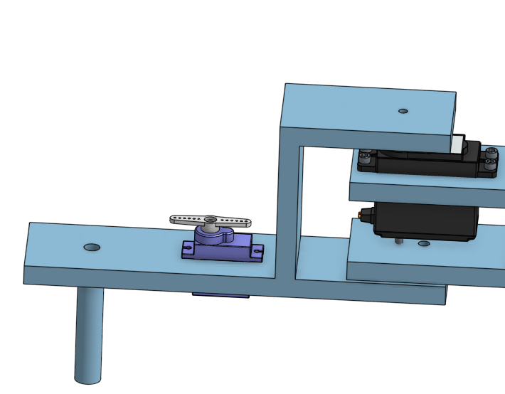 <br/>
This week I continued working on the second arm by adding a cylinder for the magnets to slide up and down, which will make their attraction stronger and weaker as they get closer and farther from the screws or whatever the arm is picking up. I also added a servo that will wind and unwind the string which will raise and lower the attached magnet inside the cylinder.

#### Code (Georgia)
This week I worked on the beginning of the code starting with creating a basic method for two servos to turn, without the involevement of kinematics. The goal for the next week is to incorporate kinematics into the code in order to adjust servo angles based on desired grid coordinates.
	
### Week 5
#### CAD (Alden)
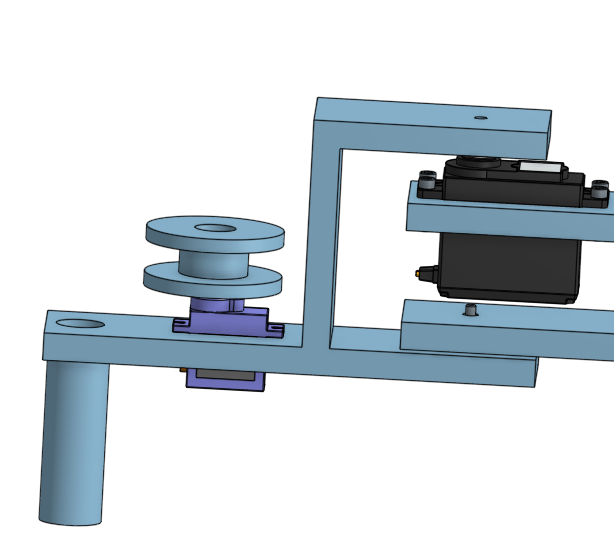 <br/>
This week I designed a spool for the string and attached it to the servo on the second arm. I also shortened the second arm since this will decrease the leverage and thus make the arm stronger.

#### Code (Georgia)
This week I continued to work on the basic code. It was much more difficult than I anticipated that it would be, especially because I was not used to working in CircuitPython. I constantly found myself having to look up certain functions, how to indent lines, etc. My goal for next week is to continue working on building a foundational code. 

### Week 6
#### CAD (Alden)
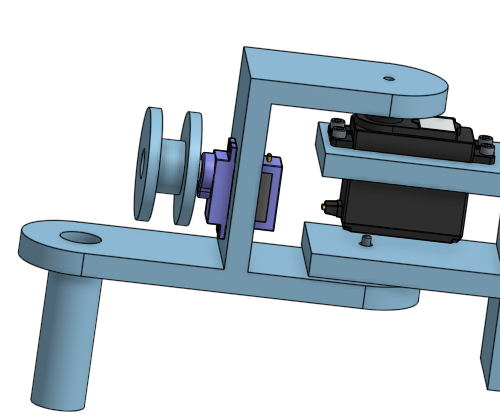 <br/>
This week I shortened the second arm even more so the length of the two arms is the same (from servo to servo and servo to end). This will make the inverse kinematic calculations much simpler since the angle of the second servo will determine the functional length of the arm and the first servo will determine where it is pointing. In order to do this, I had to move the servo to the side of the arm since it didn't fit where it was before. I also rounded the ends of the arms, partially to save material, but also because it looks much better.

#### Code (Georgia) 
I continued working on a basic code for two servos to turn via potentiometer this week and was successful in getting servos to turn, but could not adjust their angles or have them carryout any movement other than twitching. This was when I realized that I was using continuous servos as opposed to the standard angle servos that I should have been working with, so I switched over. 
	
### Week 7
#### CAD (Alden)
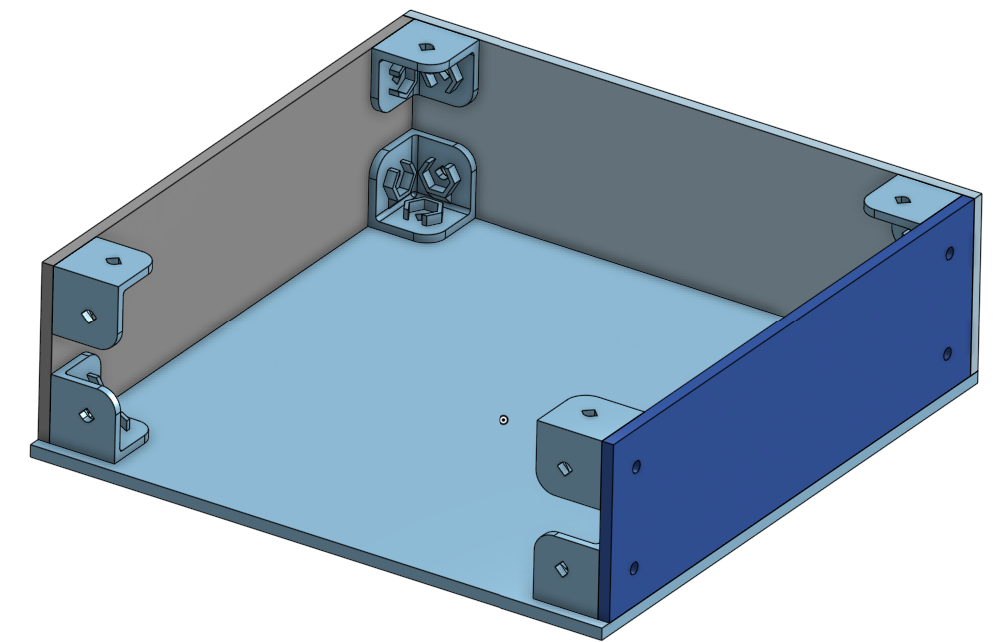 <br/>
This week I created the box that will house the Metro M0 Express and other electrical components. I used corner brackets to join the walls to each other since the only part visible on the outside is the heads of a few bolts. (Two walls are hidden in this screenshot to show the brackets)

#### Code (Georgia)	
I got two new standard servos from the lab (as well as a new USB cord because mine had been acting strange) and started working on specific angle control with these two servos, but I couldn't figure out how to code for the angle in this format. I then realized that I had still been using a continuous servo code with my new standard servos, so I began to research how to code for standard servos specifically. My original goal for this week had been to complete servo control with the computer and switch over to using potentiometers next week, but the realization that I had been using the wrong form of code set me back a bit. The continuous servo code that I was using, which used a button to control two servos, is below: 


<details><summary>Continuous Servo Code 2</summary>
	
```C++ 
	
#Continuous Servo Test Program for CircuitPython
import time
import board
import pulseio
from adafruit_motor import servo 
from digitalio import DigitalInOut, Direction, Pull

# create a PWMOut object on Pin A2.
pwm1 = pulseio.PWMOut(board.A2, frequency=50)
pwm2 = pulseio.PWMOut(board.A3, frequency=50)

# Create a servo object, my_servo.
my_servo1 = servo.ContinuousServo(pwm1)
my_servo2 = servo.ContinuousServo(pwm2)


btn = DigitalInOut(board.D2)
btn.direction = Direction.INPUT
btn.pull = Pull.UP


while True:
   
   if not btn.value:
      print("on")
      my_servo1.angle = 180
      my_servo2.angle = 180
     
       
   else:
      print("off")
      my_servo1.angle = 0
      my_servo2.angle = 0
      
      pass

   time.sleep(0.1) # sleep for debounce
 
   time.sleep(2.0)
   print("reverse")
   my_servo1.throttle = -1.0
   my_servo2.throttle = -1.0
   time.sleep(2.0)
   print("stop")
   my_servo1.throttle = 0.0
   my_servo2.throttle = 0.0
   time.sleep(4.0)

```
	
</details>
	
### Week 8
#### CAD (Alden)
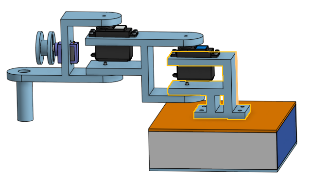 <br/>
This week I added tabs on the bottom of the first arm to attach it to the base and put bolts through to hold them together. I also rounded the arms so they can be shorter and the corners won't catch when they rotate.

#### Code (Georgia)	
When working on standard servo code I ran into an error stating that one of the servo libraries I referenced in the code, 'pwmio', could not be found. I searched through my libraries and could not find a similar file, so I downloaded the latest versions of the libraries, CircuitPython 7, from the CircuitPython website. This did not solve the problem, and I read that CircuitPy 7 was not very stable yet, and that 6 was the best version, so I deleted by CircuitPython 7 libraries and redownlaoded CircuitPython 6. 
	
### Week 9
#### CAD (Alden)
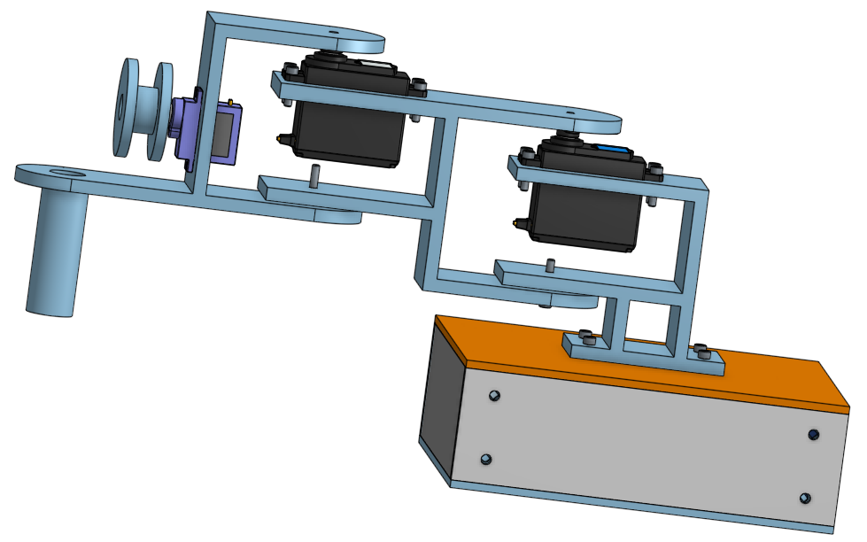 <br/>
This week I added tabs to the bottom of the first part of the arm and attached it to the base. I also spent a while changing many dimensions and updating contexts across assemblies so everything matched together. I had to make the arms thinner since they were unnecessarily thick and would have used a lot of plastic. I changed the size of many of the bolt holes since I had been making them too wide.

#### Code (Georgia)	
 While continuing to troubleshoot the library issue, I started to work on trying to replace or remove 'pwmio' from the code altogether. At one point, when I ran the code with 'pwmio' deleted, I ran into an error stating that one of my files, servo.mpy, was incompatible and could not be run unless .mpy was updated. I could not find much information on how to update .mpy files, other than by downloading the most recent libraries, which I had already done. I ended up having to download the .py version of the libraries and input the necessary files into my lib folder to replace their .mpy counterparts. 
	
### Week 10
#### CAD (Alden)
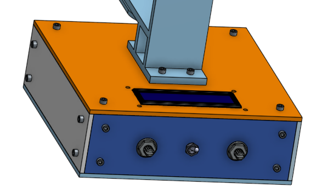 <br/>
This week I added the LCD screen, potentiometers, and Metro M0 Express to the box and created the necessary holes to attach them. I also added bolts to the CAD, which is only aesthetic, but shows how everything will attach.

#### Code (Georgia)
This week I continued to work on the 'pwmio' issue. I attempted to upload individual files that I thought might somehow include 'pwmio' into my lib folder. I even tried to run my standard servos on my old continuous servo code, in hopes that I could somehow manipulate it enough to change the angle directly. All in all, I really did not make this much progress this week and was very stuck on this issue. I continued to research 'pwmio' online, but I found very little information.  
	
### Week 11
#### CAD (Alden)
 <br/>
This week I had to make a bunch of small, but time consuming changes in CAD. I moved the spool servo to the top of the second arm since the spool wouldn't have worked where it was before because it was perpendicular to the direction the string had to be facing, which would have meant it wouldn't spool. A bunch of small changes like this that aren't as easy to see in CAD have prevented me from fabricating, despite the assembly appearing as though it is done.

#### Code (Georgia)	
This week I finally fixed the 'pwmio' problem by using the term 'pulseio', which had been used in continuous servo code, in place of 'pwmio'. This immediately solved the error. It turns out that the code I had originally found online was dated to 2018, when a different version of Circuit Python was used, and newer versions and libraries had changed their terminology for the same piece of servo library. Once I had figured this out, I had to rush to add in to other necessary aspects of the project in order to get a very rudimentary version up and running. I added in potentiometers and the third, continuous servo and ended up with a very basic form of servo control that, while not using kinematics, would conceivably work to move a robotic arm. 
	
## Project Obituary
- We were not able to finish the project; here is what we have done and what went wrong.
	
	
### Code (Georgia)

### Final Product
One of the main goals for the code of this project was to use kinematics in order to make the servos move in sync, reading angles and then adjusting based on input coordinates, but this was not accomplished. The final product used potentiometers to adjust three servos, two of which were standard servos meant to make up the arm, and a third which was continuous in order to serve as the pulley system for the magnet. The potentiometer for the first two servos adjusted their angles directly and the third adjusted the throttle of the continuous servo. The wiring and code for this setup was completed, but it was not uploaded to a prototyping shield or added to the CAD arm structure. Below are photos and videos of the final setup as well as an annotated copy of the final code. 

	


<details><summary>Final Code</summary>	
	
 ```C++
	
import time
import board
import pulseio
from adafruit_motor import servo # Import file for servo control
from analogio import AnalogIn # Import file for continuous servo control 


# create PWMOut objects on Pin A2, A3, A4.
pwm1 = pulseio.PWMOut(board.A2, duty_cycle=2 ** 15, frequency=50) 
pwm2 = pulseio.PWMOut(board.A3, duty_cycle=2 ** 15, frequency=50)
pwm3 = pulseio.PWMOut(board.A4, frequency=50)

# Create servo objects, my_servo1, my_servo2, my_servo3.
my_servo1 = servo.Servo(pwm1)
my_servo2 = servo.Servo(pwm2)
my_servo3 = servo.ContinuousServo(pwm3)


# Potentiometers on Analog Pins A1, A0, A5.
potentiometer1 = AnalogIn(board.A1)
potentiometer2 = AnalogIn(board.A0)
potentiometer3 = AnalogIn(board.A5)
    

while True:
    # Variables converting potentiometer values to servo angles/throttle value
    x= potentiometer1.value/400 + 13 
    y= potentiometer2.value/400 + 13
    z= potentiometer3.value/100000 + .3
    
    # Set continuous servo throttle to z
    my_servo3.throttle= z
    print ((z))
    
    # Set servo1 and servo2 angles to x and y. 
	
    # For angle in range is left over from continuous servo code, still functions (better) than without it. 

    for angle in range(0, 180, 5):  
	
        my_servo1.angle = x
        my_servo2.angle = y
        print((x))
        time.sleep(0.0)
        
    for angle in range(180, 0, -5): 
        my_servo1.angle = x
        my_servo2.angle = y
        print((y))
        time.sleep(0.0) # sleep time can be changed if necessary for pauses/reset

 ```
	
</details>
	
#### Wiring

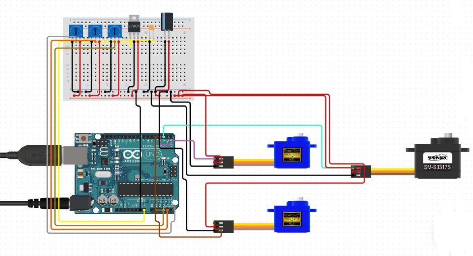 
	
- I couldn't run Fritzing on my Chromebook so I used Circuit.Io to make this diagram and its not very accurate. The program would not let me edit the pins (accurate pin assignments can be found in the final code above) and it automatically added in the capacitors and other additional components. The only components included in my actual wiring were three potentiometers, two standard servos, one continuous servo, and an arduino metro M0 (not UNO!). 
#### Images
	
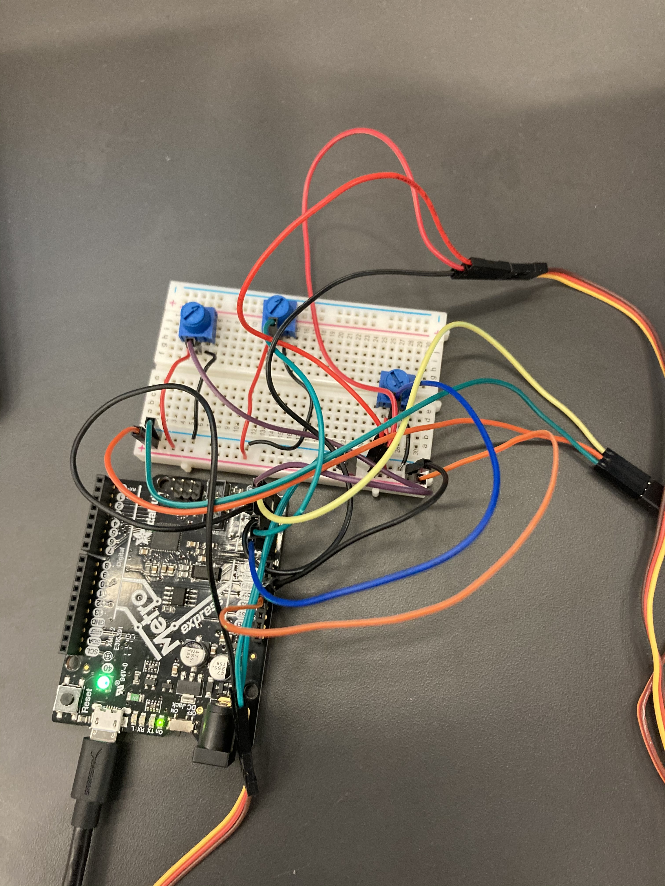
		
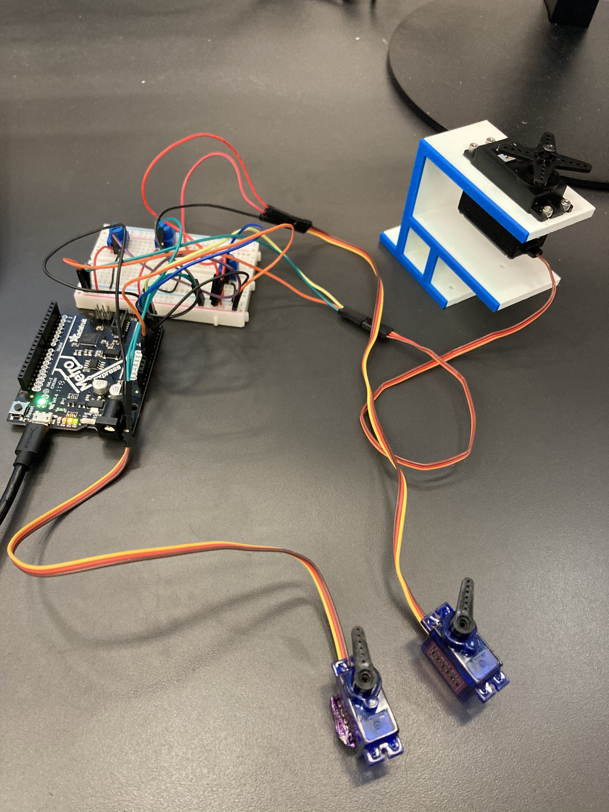 
	
- Because of the lack of accuracy in the wiring diagram and the messy wires in the photos, it might be hard to see exactly how the project was wired. It was a simple setup of 3 servos and 3 potentiometers, with each attachment connected to its pin and to the positive and negative lines on the breadboard. Ideally, the potentiometers could be lined up neatly (as shown in the diagram) but I had moved them apart in an attempt to minimize interference. The photos are a lot clearer in their original files, linked [here](https://github.com/adent11/SCARA-Electromagnetic-Arm/blob/main/Media/Photo1.jpg) and [here](https://github.com/adent11/SCARA-Electromagnetic-Arm/blob/main/Media/Photo2.jpg). Again, the pins stated in the final code (standard servos pins A2 and A3, continuous servo pin A4, potentiometers pins A0, A1, and A5) are accurate. 
	
	
#### Videos 
	
[Continuous Servo Video](https://github.com/adent11/SCARA-Electromagnetic-Arm/blob/main/Media/ContinuousServoVideo.mov)
	
[Standard Servo Video](https://github.com/adent11/SCARA-Electromagnetic-Arm/blob/main/Media/StandardServo.mov)

 
	
### Issues 
The code and wiring of this product was functioning, but it did not meet the goals set at the beginning of the project, so heres an anthology of everything that went wrong: 
	
#### Time
Its worth noting that time management was one of the major issues I had with this project. My biggest misstep was underestimating how much time I would need to actually write the code. I spent much too much time researching kinematics, thinking that once I understood it I could easily write a basic potentiometer-servo code, add in kinematics and be done with the project. However, it took much longer than I had anticipated to get a basic code up and running, so that basic code ended up becoming my final code for the project. 
	
#### CircuitPython Library Issues
One of the factors that contributed to the time it took to write basic code were the issues I had with writing CircuitPython. I was accustomed to writing in C++, which not only had a strong online community with often updated and easily searchable instructive databases, but did not require the system of libraries necessary to write in Python. Originally, I made the mistake of using continuous servos, with a continuous servo code, when I really needed code for standard servos. Once I switched over to standard servos, I continued to use the same continuous servo code format. When I realized that using continuous servo functions for a standard angle servo made specifically adjusting the angle impossible, I started to work on rewriting my code with standard servo functions and this is where the library issues began. 

As I mentioned before, CircuitPython does not have the same online community as C++ does, especially not for basics. Because of this, I could only find one real 'how-to' page related to using servos in CircuitPython [(linked here)](https://learn.adafruit.com/circuitpython-essentials/circuitpython-servo). The issue was that this webpage was written in 2018, using a much older version of CircuitPython (there are currently 7 versions, I was writing in 6, the most recent stable edition, libraries and functions update and change between versions). In the previous version of CircuitPython, 'pwmio' had been used to reference the PWM library for use with servos. However, by Citrcuit Python 6, 'pulseio' was being used to reference newer arduino_motor libraries in place of 'pwmio'. The webpage I had found used 'pulseio' for the continuous servo code, but 'pwmio' for the standard servo code. 
	
Because of this, I figured that 'pwmio' was a reference to libraries specific for standard servos and that the error I encountered upon uploading my code, stating "pwmio module not found" was the result of a problem with my installed libraries and not with the code itself. I attempted to troubleshoot this problem by deleting and reuploading various versions of CircuitPython libraries to my arduino, manually moving around files, and searching online for any individual PWM libraries that were somehow missing from my libraries. I found almost nothing on the internet related to this problem, and almost all the pages I did find were forum discussion posts concerning much higher level issues with more complex libraries. When I finally did try plugging in 'pulseio' instead of 'pwmio', the code ran perfectly with no errors becuase the correct files had been in my libraries all along. 
	
An additional issue that I encountered in the midst of changing and reuploading libraries was a problem with the distinction between .py and .mpy files. I ran into an error stating that my file servo.mpy could not be run because of its micropython format, and that I had to be sure to update all .mpy files. The error notice redirected me to a link [(found here)](https://circuitpython.readthedocs.io/en/latest/docs/troubleshooting.html#valueerror-incompatible-mpy-file) which simply instructed me to use the most recent edition of CircuitPython libraries to avoid errors. In the end, I ended up uploading the .py versions of all library files, which resolved the error. 
	
#### Other Errors
	
#### Button 
I had initially planned to use a button to control the continuous servo for the pulley system. However, when I tried to add a button to my wiring, I found that whenever I pressed to button my arduino, although securly attached by USB, would be breifly ejected from my computer. This issue was truly bizarre because there was nothing in my code or wiring for the button that would connect it to the USB system of the computer. My best guess is that, since a power surge from the button initially affected the continuous servo, that same power surge was affecting the USB. I resolved this by switching from using a button to a potentiometer. 
	
#### USB 
Though removing the button resolved the issue of the arduino being rejected from the computer, the connection was still slightly unstable and would cause errors stating that the arduino was experiencing dips in power. After switching through a coupld different USB cords, I decided that it was most likely an issue with my chromebook, so I switched to using one of the computers in the Sigma Lab, which resolved the issue. 
	

#### Interference 
Once the code was running and the wiring was complete, there was a problem where the two standard servos would twitch randomly or change angles before self-adjusting when the potentiometers of the other servos were adjusted. This error can be seen in the videos of the final product linked [here](https://github.com/adent11/SCARA-Electromagnetic-Arm/blob/main/Media/ContinuousServoVideo.mov) and [here](https://github.com/adent11/SCARA-Electromagnetic-Arm/blob/main/Media/StandardServo.mov). In C++, similar issues would have been solved with servo.detach functions so that servos would not move when not in use. However, servo.detach functions do not exist in CircuitPython and there are no similar functions available. The best way to solve this problem would most likley have been by adding transistors to the circuit, one connected to each servo, and then adding functions deconnecting the transistors- thus deconnecting the servos- and times when the servos would not be in use. However this solution could not be implemented due to lack of time. 
	
### TL;DR
 - Continuous servos require continuous servo code and standard servos require standard servo code; these don't work well when switched. 
 - The lack of frequently updated instructional pages for CircuitPython means that all information and code obtained online should be taken with an extra grain of salt,   CHECK DATES, use multiple sources, etc. 
 - If you encounter an issue with your libraries, and you have the most recent and stable version downloaded, then the issue is likely with the way your code is  	    referencing the libraries and not the content of the libraries themselves.
- For recent versions of CircuitPython use 'pulseio' for servo control as opposed to 'pwmio'.
- Replacing .mpy files with their .py equivalents (NOT JUST CHANGING THE FILE NAMES) solves .mpy update issues. 
- Buttons may cause issues with USB connections somehow, switch buttons out for other control devices (i.e. potentiometers) if this happens. 
- Power dips experienced by the arduino can be resolved by switching computers or potentially by switching USB cables. 
- Interference between servos cannot be solved by servo.detach functions in CircuitPython. Using transistors and coding for them to deconnect when needed is a potential solution. 
- The link for the webpage I used for most of the coding is found [here](https://learn.adafruit.com/circuitpython-essentials/circuitpython-servo). REMEMBER TO REPLACE PWMIO WITH PULSEIO IN THIS CODE!
### Future Improvements
If there had been more time for this project, the first thing I would address would be the interference issue with the servos, which I would fix using transistors as described above. Then I would have cleaned up the wiring. I had custom cut smaller wires in the photos I took, but there were still quite a few jumper cables, and it probably would have been best to transfer the project onto a prototyping board anyway. Next I would have tried to implement kinematics functions in order to control the servos through computer input. The equations for this are shown in the planning section of the project and this effort would mostly have involved creating variables and setting uo the equations, which I already had some experience with in the basic code. While I went into this project with the goal of learning and implementing kinematics, in the end I did not accomplish this, but I did learn a significant amount about coding in CircuitPython and navigating libraries, especially with limited online information. 
	
### CAD (Alden)
### Final Product
By the end of the year I finished all of the CAD and fulfilled all of the goals set at the beginning of the project. Using two servo joints, the arm is able to reach anywhere within the radius of the length of the arm fully extended. (about 8 inches) <br/>
The first joint allows it to move like this, pointing towards any direction.
<br/> 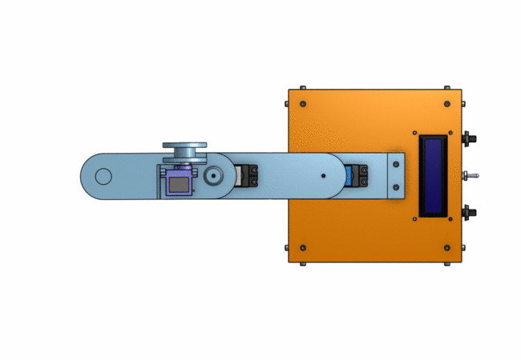 <br/>
The second joint allows the length of the arm to be changed so it can reach any distance within the full extension and the limit of how acute the angle between the first and second arms can become.

In combination, these allow the end of the arm to move to any point between the radius of the arm fully extended and the radius of the arm fully bent.
