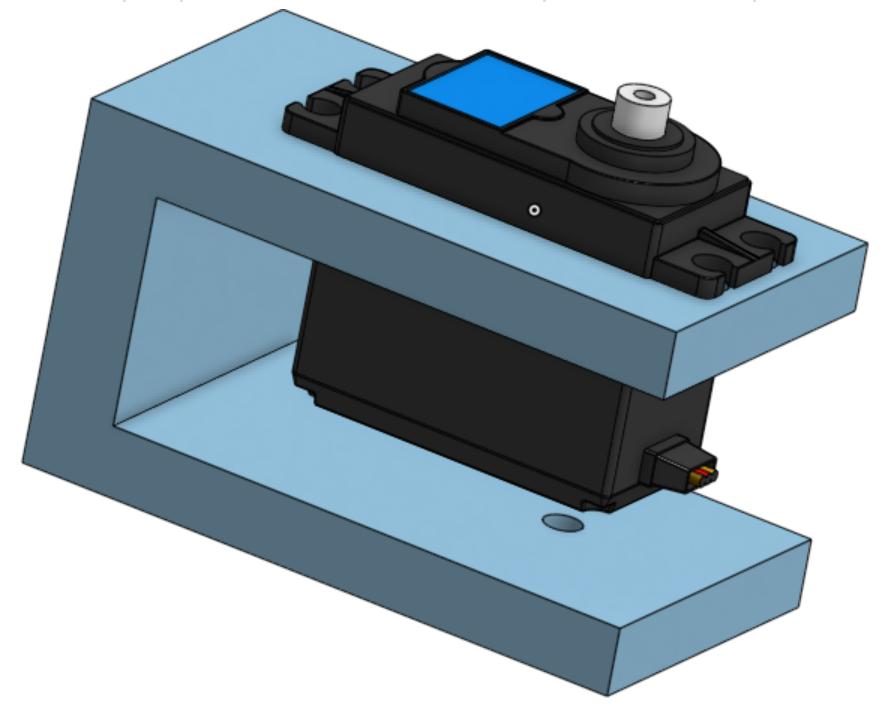
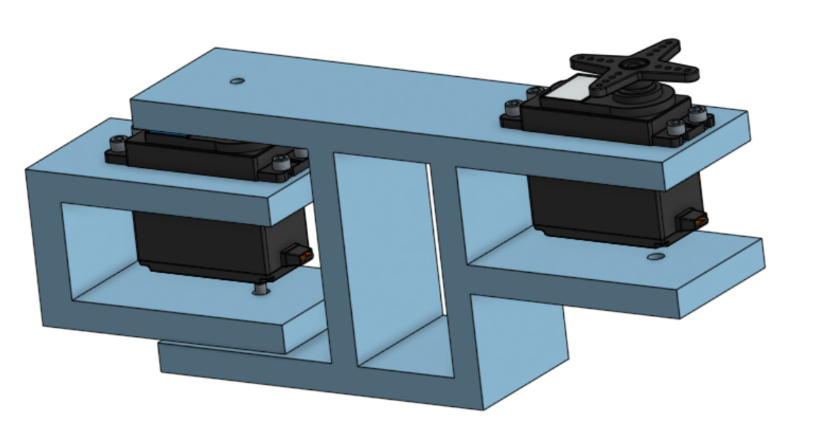
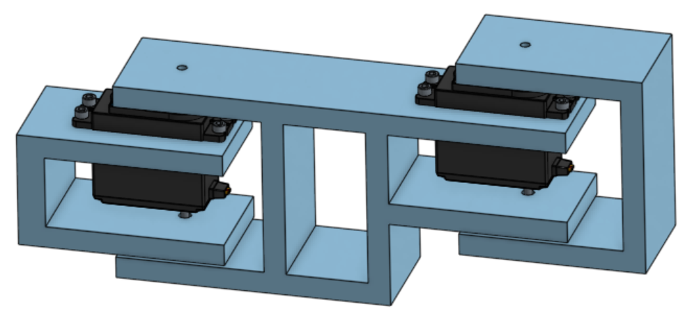

# SCARA Electromagnetic Arm 

## Plan 
  
  ### Goal
  To build a robotic arm that will be able to electromagnetically move and sort metal pieces to precise locations.
      
  ### Specifics
 Will be a SCARA type robot arm and will utilise inverse kinematics in order to move in the x and y plane. Inverse kinematics refers to positioning and moving the arm based on calculated joint angles. The arm will be fixed in the y-direction and an electromagnet will be used to lift and sort pieces. The desired positioning values will be entered into the robot via a computer interface. 
      
      
 ### Code 
  
 #### Pseudocode 1
 
 ```C++

Void setup()

magnet.pin = n

Move.arm ()
	Servoangle.read (ፀx0, ፀy0)
	Position.read(x1,y1) 
	Angle.calc (ፀx1, ፀy1) 
	Angle.calc (ፀx1-ፀx0, ፀy1-ፀy0) = val 1
	Servo.move (val 1) 
	# redo with increasing numbers, save data of initial angle. Ex new ፀx0= old ፀx1


Magnet.on()
	magnet.pin (HIGH,)

Magnet.off()
	magnet.pin (LOW) 

Void loop() 

Move.arm  (x0,y0 to x1,y1)

Magnet.on 

move.arm (x1, y1 to x2, y2)

Magnet.off 


 ```
 #### Pseudocode 2
 
 ```C++

Void setup()

Servo_x.attach(n).

Servo_Y.attach(n)

Servo_3.attach(n) 


Move.arm ()
	Servo_x.angleread(ፀx0) 
	Servo_y.angleread(ፀy0)
	
	Position.read(x1,y1) 
	    potentiometerx.read= x1 
	    potentiometery.read= y1
	    LCD.write ('x1', 'y1') 
	    
	
	Angle.calc (ፀx1, ፀy1)
	# need a grid of some kind to locate positions. Then need a formula to calculate servo angles based on grid positions.  
	
	Angle.calc (ፀx1-ፀx0, ፀy1-ፀy0) = val 1x, val 1y
		val ፀx1-ፀx0 = val 1x
		val ፀy1-ፀy0 = val 1y
	Servo_x.move (val 1x)
	Servo_y.move (val 1y) 
	# redo with increasing numbers, save data of initial angle. Ex new ፀx0= old ፀx1


Magnet.on()
	Servo_3.write(90) 
	
Magnet.off()
	Servo_3.write(0)  

Void loop() 

Move.arm  #(x0,y0 to x1,y1)

Magnet.on 

move.arm #(x1, y1 to x2, y2)

Magnet.off 


 ```
          

 #### Formula 
 
 Kinematics formulas for x,y to servo angle conversions: 
 
 First servo angle: q1= tan^-1 y/x - tan^-1 (a2* sinq2)/(a1 + a2* cosq2) 
 
 Second servo angle: q2= cos^-1 (x^2 + y^2 - a1^2 - a2^2) / (2a1*a2)
 
 a1= First arm length
 
 a2= Second arm length
  
### OnShape "Pseudocode"

[OnShape Model](https://cvilleschools.onshape.com/documents/f6d9cc65e05e26eae1d5c45a/w/8edde5e97c4994cb9e9d50f3/e/d1962944a79fd9c4dc7f6611) <br/>
[OnShape VERY Rough Prototype](https://cvilleschools.onshape.com/documents/0627f950d927ef87b77603c8/w/3575573e58b9fedf54dfd438/e/1fe431af62f1e4169310c066)

### Web Links
 - A place to put any potentially useful website links: 
      - [Aphex Twin Themed SCARA Robot Instructables](https://www.instructables.com/SCARA-Robot-Learning-About-Foward-and-Inverse-Kine/) 
      - [Ball Drop Joystick SCARA Robot](https://create.arduino.cc/projecthub/311549/scara-arm-controlled-by-joystick-486870) 
      - [Kinematics Formula Walkthrough Video](https://robotacademy.net.au/lesson/inverse-kinematics-for-a-2-joint-robot-arm-using-geometry/)


### Week 1
#### CAD (Alden)
 <br/>
[Servo Bracket](https://cvilleschools.onshape.com/documents/575ef6b5b2807b09a30dcc8b/w/4e40a84d3513593e765af328/e/250a50aca4f88581c475a6ac)
<br/>
This week I designed the bracket that will hold the servo and prevent the leverage of the arm from breaking the servo. It was fairly simple to do; I just had to look up where the use/project feature was. My goal for next week is to design the first arm.

#### Code (Georgia)
 This week I created a second version of the pseudocode with further specifications (Pseudocode 2). While working on this, I realized that in order to progress further with creating the code I would have to find a working formula for the kinematics of the arm (converting x,y grid coordinates into servo angles) so that's my goal for week two. 
 
### Week 2 
#### CAD (Alden)
 <br/>
[First Arm](https://cvilleschools.onshape.com/documents/575ef6b5b2807b09a30dcc8b/w/4e40a84d3513593e765af328/e/6c75b69a643d8fb6d7615803)
<br/>
This week I designed the first arm by creating the end that connects to the servo and bracket and adding another servo/bracket combination at the other end for the second arm to be attached to. Something useful that I learned is that when you are editing a part in a context inside of an assembly then add something new to the assembly, if you want to use geometry from the thing you just added you need to create a new context to edit the part in.

#### Code (Georgia)
For week two I completed my goal of finding an appropriate kinematics formula for the code conversion of grid coordinates into servo angles. The formula was much more complicated then I had expected and requires arm lengths for specifics, we don't have that information yet but will add it later once CAD is complete. 

### Week 3
#### CAD (Alden)
 <br/>
[SecondArm](https://cvilleschools.onshape.com/documents/575ef6b5b2807b09a30dcc8b/w/4e40a84d3513593e765af328/e/5b170ee752ddc82e6ee3fde4)
<br/>
This week I added bolts to everything and designed the part of the second arm that attaches to the first. I learned that when you add a new to an assembly and want to edit another part using geometry from the new one, if you have already created a context to edit the old part in, you can either update that context, which adds the new part to the context, or create a new context, in which case you can switch between the two (or more) contexts.

#### Code (Georgia) 
This week I worked on the beginning of the code starting with creating a basic method for two servos to turn, without the involevement of kinematics. The goal for the next week is to incorporate kinematics into the code in order to adjust servo angles based on desired grid coordinates. 

### Week 4
#### CAD (Alden)
This week I continued working on the second arm by adding a cylinder for the magnets to slide up and down, which will make their pull stronger and weaker as they get closer and farther from the screws or whatever the arm is picking up.

#### Code (Georgia)


### Week 5
#### CAD (Alden)
This week I attached a servo to the second arm and designed a spool for the string that will attach to the magnets to raise and lower them. I had to move this servo from the bottom to the side of the arm in order to make the arm shorter, which both decreases the leverage, and makes both arms the same length, which makes the inverse kinematic calculations much simpler.

### Week 6
#### CAD (Alden)
This week I created the box that will house the Metro M0 Express and other electrical components. I used corner brackets to join the walls to each other since the only part visible on the outside is the heads of a few bolts.

### Week 7
#### CAD (Alden)
This week I added tabs on the bottom of the first arm to attach it to the base and put bolts through to hold them together. I also rounded the arms so they can be shorter and the corners won't catch when they rotate.

### Week 8
#### CAD (Alden)
This week I didn't make much progress since I had to change many dimensions and update contexts across many assemblies so everything matched together. I had to make the arms thinner since they were unnecessarily thick and would have used a lot of plastic. I also had to change the size of many of the bolt holes since I had been making them too wide.
