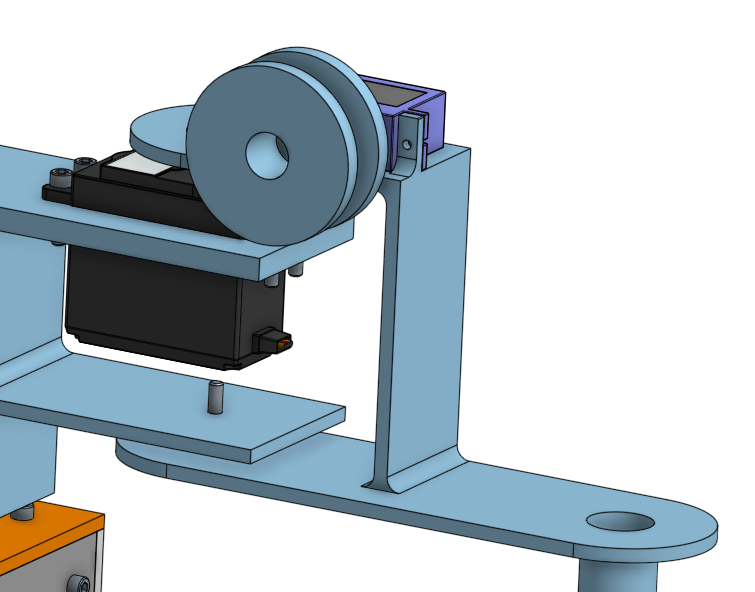

# SCARA Electromagnetic Arm 

<summary><b>Pre-Project Planning</b></summary>
<p>
  
  ### Goal
  To build a robotic arm that will be able to electromagnetically move and sort metal pieces to precise locations.
      
  ### Specifics
 Will be a SCARA type robot arm and will utilise inverse kinematics in order to move in the x and y plane. Inverse kinematics refers to positioning and moving the arm based on calculated joint angles. The arm will be fixed in the y-direction and an electromagnet will be used to lift and sort pieces. The desired positioning values will be entered into the robot via a computer interface. 
      
      
 ### Code 
  
<details><summary>Pseudocode 1</summary>
 
 ```C++

Void setup()

magnet.pin = n

Move.arm ()
	Servoangle.read (ፀx0, ፀy0)
	Position.read(x1,y1) 
	Angle.calc (ፀx1, ፀy1) 
	Angle.calc (ፀx1-ፀx0, ፀy1-ፀy0) = val 1
	Servo.move (val 1) 
	# redo with increasing numbers, save data of initial angle. Ex new ፀx0= old ፀx1


Magnet.on()
	magnet.pin (HIGH,)

Magnet.off()
	magnet.pin (LOW) 

Void loop() 

Move.arm  (x0,y0 to x1,y1)

Magnet.on 

move.arm (x1, y1 to x2, y2)

Magnet.off 


 ```
</details>
<details><summary>Pseudocode 2</summary>
 
 ```C++

Void setup()

Servo_x.attach(n).

Servo_Y.attach(n)

Servo_3.attach(n) 


Move.arm ()
	Servo_x.angleread(ፀx0) 
	Servo_y.angleread(ፀy0)
	
	Position.read(x1,y1) 
	    potentiometerx.read= x1 
	    potentiometery.read= y1
	    LCD.write ('x1', 'y1') 
	    
	
	Angle.calc (ፀx1, ፀy1)
	# need a grid of some kind to locate positions. Then need a formula to calculate servo angles based on grid positions.  
	
	Angle.calc (ፀx1-ፀx0, ፀy1-ፀy0) = val 1x, val 1y
		val ፀx1-ፀx0 = val 1x
		val ፀy1-ፀy0 = val 1y
	Servo_x.move (val 1x)
	Servo_y.move (val 1y) 
	# redo with increasing numbers, save data of initial angle. Ex new ፀx0= old ፀx1


Magnet.on()
	Servo_3.write(90) 
	
Magnet.off()
	Servo_3.write(0)  

Void loop() 

Move.arm  #(x0,y0 to x1,y1)

Magnet.on 

move.arm #(x1, y1 to x2, y2)

Magnet.off 

```
	
</details>
<details><summary>Test Code 1</summary>	
	
 ```C++

#Continuous Servo Test Program for CircuitPython
import time
import board
import pulseio
from adafruit_motor import servo
from digitalio import DigitalInOut, Direction, Pull
 
# create a PWMOut object on Pin A2.
pwm1 = pulseio.PWMOut(board.A2, frequency=50)
pwm2 = pulseio.PWMOut(board.A3, frequency=50)
 
# Create a servo object, my_servo.
my_servo1 = servo.ContinuousServo(pwm1)
my_servo2 = servo.ContinuousServo(pwm2)


btn = DigitalInOut(board.D2)
btn.direction = Direction.INPUT
btn.pull = Pull.UP


while True:
    
    if not btn.value:
       print("on")
       my_servo1.angle = 180
       my_servo2.angle = 180
      
        
   else:
       print("off")
       my_servo1.angle = 0
       my_servo2.angle = 0
       
       pass

    time.sleep(0.1) # sleep for debounce
  
    time.sleep(2.0)
    print("reverse")
    my_servo1.throttle = -1.0
    my_servo2.throttle = -1.0
    time.sleep(2.0)
    print("stop")
    my_servo1.throttle = 0.0
    my_servo2.throttle = 0.0
    time.sleep(4.0)


 ```
Above is the most recent version of the code. There are two main issues with this, the first being that it is using continuous servo code for non continuous servos. This means that the servos will move, but, since they are meant to be controlled by angle and not by speed, will not respond correctly. However, due to errors with the pwmio module on my computer, I'm not sure how to use the PWMio control meant for these servos. The other issue with this is that it uses a button as opposed to a potentiometer (buttons are the only control switches I have) which makes for less accurate angle control. This issue should be easy to solve by switching over to a potentiometer once in the lab tommorow. This code also does not use kinematics, but considering the problems with even getting PWM libraries to run, my main goal is just to create a basic version of this code where servos can be controlled by angle with a potentiometer to manually guide the robotic arm. 
	
	
</details>
	
 ### Inverse Kinematic Math
 We plan to use inverse kinematics, which means that we will input the desired location of the end of the arm in x and y coordinates, and it will calculate what angle the first and second arm should be at to put the end at that given point. Here is some of the math necessary to calculate the servo angles.
 
 Kinematics formulas for x,y to servo angle conversions: 
 
 First servo angle: q1= tan^-1 y/x - tan^-1 (a2* sinq2)/(a1 + a2* cosq2) 
 
 Second servo angle: q2= cos^-1 (x^2 + y^2 - a1^2 - a2^2) / (2a1*a2)
 
 a1= First arm length
 
 a2= Second arm length
  
### OnShape "Pseudocode"

[OnShape Model](https://cvilleschools.onshape.com/documents/f6d9cc65e05e26eae1d5c45a/w/8edde5e97c4994cb9e9d50f3/e/d1962944a79fd9c4dc7f6611) <br/>
[OnShape VERY Rough Prototype](https://cvilleschools.onshape.com/documents/0627f950d927ef87b77603c8/w/3575573e58b9fedf54dfd438/e/1fe431af62f1e4169310c066)

### Web Links
 - Here are some websites with valuable information: 
      - [Aphex Twin Themed SCARA Robot Instructables](https://www.instructables.com/SCARA-Robot-Learning-About-Foward-and-Inverse-Kine/) 
      - [Ball Drop Joystick SCARA Robot](https://create.arduino.cc/projecthub/311549/scara-arm-controlled-by-joystick-486870) 
      - [Kinematics Formula Walkthrough Video](https://robotacademy.net.au/lesson/inverse-kinematics-for-a-2-joint-robot-arm-using-geometry/)

</p>

### Week 1
#### CAD (Alden)
 <br/>
[Servo Bracket](https://cvilleschools.onshape.com/documents/575ef6b5b2807b09a30dcc8b/w/4e40a84d3513593e765af328/e/250a50aca4f88581c475a6ac)
<br/>
This week I designed the bracket that will hold the servo and prevent the leverage of the arm from breaking the servo. It was fairly simple to do; I just had to look up where the use/project feature was. My goal for next week is to design the first arm.

#### Code (Georgia)
 This week I created a second version of the pseudocode with further specifications (Pseudocode 2). While working on this, I realized that in order to progress further with creating the code I would have to find a working formula for the kinematics of the arm (converting x,y grid coordinates into servo angles) so that's my goal for week two. 
 
### Week 2 
#### CAD (Alden)
 <br/>
[First Arm](https://cvilleschools.onshape.com/documents/575ef6b5b2807b09a30dcc8b/w/4e40a84d3513593e765af328/e/6c75b69a643d8fb6d7615803)
<br/>
This week I designed the first arm by creating the end that connects to the servo and bracket and adding another servo/bracket combination at the other end for the second arm to be attached to. Something useful that I learned is that when you are editing a part in a context inside of an assembly then add something new to the assembly, if you want to use geometry from the thing you just added you need to create a new context to edit the part in.

#### Code (Georgia)
For week two I completed my goal of finding an appropriate kinematics formula for the code conversion of grid coordinates into servo angles. The formula was much more complicated then I had expected and requires arm lengths for specifics, we don't have that information yet but will add it later once CAD is complete. 

### Week 3
#### CAD (Alden)
 <br/>
[SecondArm](https://cvilleschools.onshape.com/documents/575ef6b5b2807b09a30dcc8b/w/4e40a84d3513593e765af328/e/5b170ee752ddc82e6ee3fde4)
<br/>
This week I added bolts to everything and designed the part of the second arm that attaches to the first. I learned that when you add a new to an assembly and want to edit another part using geometry from the new one, if you have already created a context to edit the old part in, you can either update that context, which adds the new part to the context, or create a new context, in which case you can switch between the two (or more) contexts.

#### Code (Georgia) 
This week I worked on the beginning of the code starting with creating a basic method for two servos to turn, without the involevement of kinematics. The goal for the next week is to incorporate kinematics into the code in order to adjust servo angles based on desired grid coordinates. 

### Week 4
#### CAD (Alden)
 <br/>
This week I continued working on the second arm by adding a cylinder for the magnets to slide up and down, which will make their attraction stronger and weaker as they get closer and farther from the screws or whatever the arm is picking up. I also added a servo that will wind and unwind the string which will raise and lower the attached magnet inside the cylinder.

#### Code (Georgia)


### Week 5
#### CAD (Alden)
 <br/>
This week I designed a spool for the string and attached it to the servo on the second arm. I also shortened the second arm since this will decrease the leverage and thus make the arm stronger.

### Week 6
#### CAD (Alden)
 <br/>
This week I shortened the second arm even more so the length of the two arms is the same (from servo to servo and servo to end). This will make the inverse kinematic calculations much simpler since the angle of the second servo will determine the functional length of the arm and the first servo will determine where it is pointing. In order to do this, I had to move the servo to the side of the arm since it didn't fit where it was before. I also rounded the ends of the arms, partially to save material, but also because it looks much better.

### Week 7
#### CAD (Alden)
 <br/>
This week I created the box that will house the Metro M0 Express and other electrical components. I used corner brackets to join the walls to each other since the only part visible on the outside is the heads of a few bolts. (Two walls are hidden in this screenshot to show the brackets)

### Week 8
#### CAD (Alden)
 <br/>
This week I added tabs on the bottom of the first arm to attach it to the base and put bolts through to hold them together. I also rounded the arms so they can be shorter and the corners won't catch when they rotate.

### Week 9
#### CAD (Alden)
 <br/>
This week I added tabs to the bottom of the first part of the arm and attached it to the base. I also spent a while changing many dimensions and updating contexts across assemblies so everything matched together. I had to make the arms thinner since they were unnecessarily thick and would have used a lot of plastic. I changed the size of many of the bolt holes since I had been making them too wide.
	
### Week 10
#### CAD (Alden)
 <br/>
This week I added the LCD screen, potentiometers, and Metro M0 Express to the box and created the necessary holes to attach them. I also added bolts to the CAD, which is only aesthetic, but shows how everything will attach.
	
### Week 11
#### CAD (Alden)
 <br/>
This week I had to make a bunch of small, but time consuming changes in CAD. I moved the spool servo to the top of the second arm since the spool wouldn't have worked where it was before because it was perpendicular to the direction the string had to be facing, which would have meant it wouldn't spool. A bunch of small changes like this that aren't as easy to see in CAD have prevented me from fabricating, despite the assembly appearing as though it is done.

## Project Obituary
We were not able to finish the project; here is what we have done and what went wrong.

### CAD (Alden)
### Final Product
By the end of the year I finished all of the CAD and fulfilled all of the goals set at the beginning of the project. Using two servo joints, the arm is able to reach anywhere within the radius of the length of the arm fully extended. (about 8 inches) <br/>
The first joint allows it to move like this, pointing towards any direction.
<br/>  <br/>
The second joint allows the length of the arm to be changed so it can reach any distance within the full extension and the limit of how acute the angle between the first and second arms can become.

In combination, these allow the end of the arm to move to any point between the radius of the arm fully extended and the radius of the arm fully bent.
